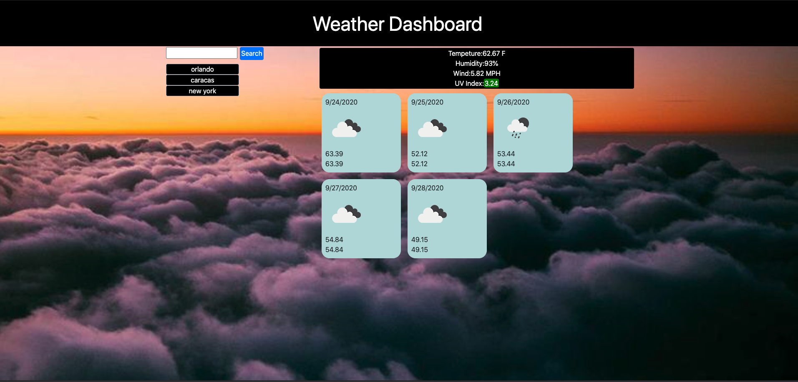

# 6_homeWork

## My Respository
The following link is the access to the Weather App Repository(https://github.com/japb1998/6_homeWork). 

On this homeWork we are creating a weather app where you will be able to search for the current weather and the 5 days Forecast for any city you want.
## Files
contains an index.html file with the structure of my app, a  style.css giving the styling to my app and we have a script.js giving the functionality that it needs.

## APP
 

## Instructions
1. The user use the input to tell the app the city he/she is looking for.
2. click the button search.
3. once the city is created on the city display list the user can click the especific city and the weather will get displayed again.